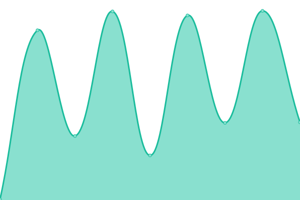
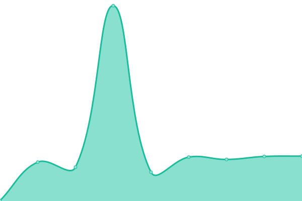

# [📈 Live Status](https://developermelodi.github.io/mm_monitors): <!--live status--> **🟧 Partial outage**

This repository contains the open-source uptime monitor and status page for [developermelodi](https://upptime.js.org), powered by [Upptime](https://github.com/upptime/upptime).

With [Upptime](https://upptime.js.org), you can get your own unlimited and free uptime monitor and status page, powered entirely by a GitHub repository. We use [Issues](https://github.com/developermelodi/mm_monitors/issues) as incident reports, [Actions](https://github.com/developermelodi/mm_monitors/actions) as uptime monitors, and [Pages](https://upptime.js.org) for the status page.

<!--start: status pages-->
<!-- This summary is generated by Upptime (https://github.com/upptime/upptime) -->
<!-- Do not edit this manually, your changes will be overwritten -->
<!-- prettier-ignore -->
| URL | Status | History | Response Time | Uptime |
| --- | ------ | ------- | ------------- | ------ |
|  [MelodyMocktail](https://melodymocktail.com) | 🟩 Up | [melody-mocktail.yml](https://github.com/developermelodi/mm_monitors/commits/HEAD/history/melody-mocktail.yml) | 

 111ms
     
 | 

<a href="https://developermelodi.github.io/mm_monitors/history/melody-mocktail">87.59%</a>
    

|  [www.MelodyMocktail](https://www.melodymocktail.com) | 🟥 Down | [www-melody-mocktail.yml](https://github.com/developermelodi/mm_monitors/commits/HEAD/history/www-melody-mocktail.yml) | 

 146ms
     
 | 

<a href="https://developermelodi.github.io/mm_monitors/history/www-melody-mocktail">69.07%</a>
    

|  [MelodyAdminSite](https://admin.melodymocktail.com) | 🟩 Up | [melody-admin-site.yml](https://github.com/developermelodi/mm_monitors/commits/HEAD/history/melody-admin-site.yml) | 

 150ms
     
 | 

<a href="https://developermelodi.github.io/mm_monitors/history/melody-admin-site">100.00%</a>
    

|  [Webinars](https://webinars.melodymocktail.com) | 🟩 Up | [webinars.yml](https://github.com/developermelodi/mm_monitors/commits/HEAD/history/webinars.yml) | 

 658ms
     
 | 

<a href="https://developermelodi.github.io/mm_monitors/history/webinars">100.00%</a>
    

|  [Google](https://google.com) | 🟩 Up | [google.yml](https://github.com/developermelodi/mm_monitors/commits/HEAD/history/google.yml) | 

 83ms
     
 | 

<a href="https://developermelodi.github.io/mm_monitors/history/google">100.00%</a>
    

|  [wwGoogle](https://www.google.com) | 🟩 Up | [ww-google.yml](https://github.com/developermelodi/mm_monitors/commits/HEAD/history/ww-google.yml) | 

 56ms
     
 | 

<a href="https://developermelodi.github.io/mm_monitors/history/ww-google">100.00%</a>
    

<!--end: status pages-->

[**Visit our status website →**](https://upptime.js.org)

## 📄 License

- Powered by: [Upptime](https://github.com/upptime/upptime)
- Code: [MIT](./LICENSE) © [Anand Chowdhary](https://anandchowdhary.com), supported by [Pabio](https://pabio.com)
- Data in the `./history` directory: [Open Database License](https://opendatacommons.org/licenses/odbl/1-0/)
